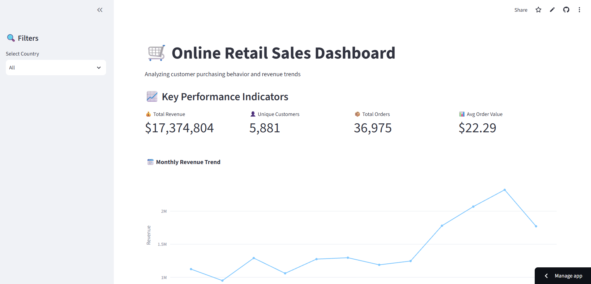

# 🛒 Online Retail Sales Dashboard

## 📊 Live Demo
👉 [Click here to view the live dashboard](https://sales-dashboard-khadija-elkattany.streamlit.app)

---

## 📌 Project Overview
This is an **interactive sales dashboard** built with Python, SQL, and Streamlit. It analyzes **780,000+ retail transactions** from the Online Retail II dataset to uncover sales trends, customer behavior, and product performance.

The dashboard automatically updates when you apply filters (e.g., by country), giving you real-time insights into revenue, top products, and customer segments.

---

## 🔍 Key Business Insights

| Insight | Value |
|---------|-------|
| 📈 **Peak Month** | **November** ($2.32M in sales) – holiday shopping starts early! |
| 🇬🇧 **Top Market** | **United Kingdom** (82.8% of total revenue) |
| 🏆 **Best Seller** | *"WORLD WAR 2 GLIDERS ASSTD DESIGNS"* (105,185 units sold) |

---

## 🛠️ Tech Stack

| Tool | Purpose |
|------|---------|
| **Python** | Data processing & analysis |
| **Pandas** | Data cleaning & manipulation |
| **SQLite** | Local database for querying |
| **SQL** | Data extraction & aggregation |
| **Plotly** | Interactive visualizations |
| **Streamlit** | Dashboard & user interface |
| **Streamlit Cloud** | Deployment & hosting |

---

## 📁 Dataset

- **Source:** [UCI Machine Learning Repository – Online Retail II](https://archive.ics.uci.edu/ml/datasets/Online+Retail+II)
- **Size:** 780,000+ rows
- **Period:** 2009–2011
- **Content:** Transactions from a UK-based online retailer

---

## 🏗️ Project Structure

```
retail_analytics/
├── dataset/
│   └── myapp.db              # SQLite database (full cleaned data)
├── app.py                    # Main Streamlit dashboard
├── load_to_db.py             # ETL script to build the database
├── test_queries.py           # SQL queries for testing
├── insights.py               # Business insight generator
├── requirements.txt          # Python dependencies
├── README.md                 # Project documentation
└── screenshot.png            # Dashboard preview
```

---

## 📸 Dashboard Preview




---

## 🚀 How to Run Locally

1. **Clone the repository**
   ```bash
   git clone https://github.com/khadija-ELKATTANY/sales-dashboard.git
   cd sales-dashboard
   ```

2. **Create a virtual environment**
   ```bash
   python -m venv venv
   source venv/bin/activate  # On Windows: venv\Scripts\activate
   ```

3. **Install dependencies**
   ```bash
   pip install -r requirements.txt
   ```

4. **Run the dashboard**
   ```bash
   streamlit run app.py
   ```

5. Open your browser at `http://localhost:8501`

---

## 🧠 What I Learned

- Cleaning and preparing real-world data with Pandas
- Writing complex SQL queries in SQLite
- Building interactive dashboards with Streamlit
- Creating dynamic visualizations with Plotly
- Connecting Python to a SQL database
- Deploying a data app to the cloud
- Writing business insights from raw data

---

## 📬 Connect with Me

- **LinkedIn:** [(https://www.linkedin.com/in/khadija-elkattany-1ba38b399)]
- **GitHub:** [khadija-ELKATTANY](https://github.com/khadija-ELKATTANY)


